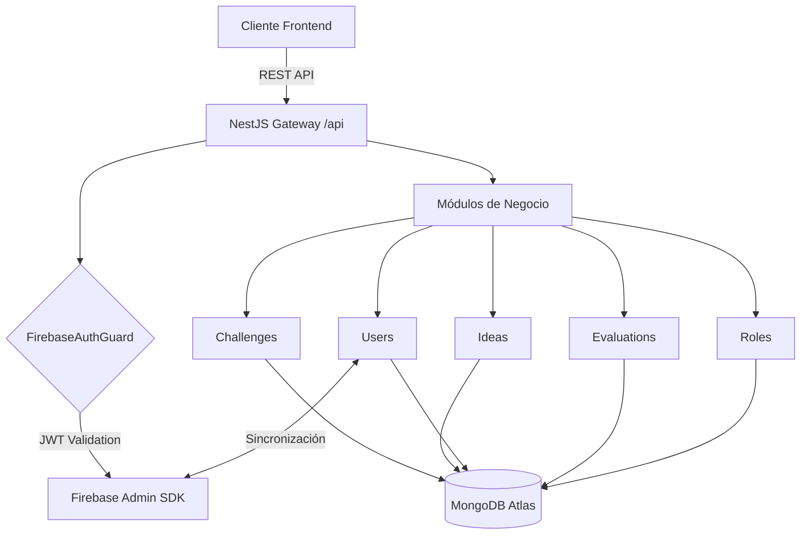

# 🚀 Pista 8 - Backend (Core Engine)

Este repositorio contiene el núcleo lógico y la API del sistema **Pista 8**, una plataforma de innovación y generación de ideas. Desarrollado por el **Equipo 15**, el sistema emplea una arquitectura modular basada en **NestJS** para garantizar escalabilidad, mantenibilidad y robustez.

## 🏛️ Arquitectura del Sistema

El backend sigue un patrón de **Módulos de Dominio** encapsulados en NestJS. Cada módulo gestiona su propia lógica de persistencia, validación y exposición REST.



### Componentes Clave
- **Modules**: Unidades funcionales independientes.
- **Common**: Interceptores de serialización (Transform) y filtros de excepciones HTTP.
- **Database**: Capa de abstracción de Mongoose para la conexión con Atlas.
- **Validators**: Guardas de seguridad para la interceptación de tokens Bearer.

## 📁 Estructura del Proyecto

```text
backend/
├── src/
│   ├── common/         # Interceptores (Serialización JSON) y Filtros de Errores.
│   ├── config/         # Configuración de variables de entorno y Firebase Admin.
│   ├── database/       # Proveedores de conexión Mongoose.
│   ├── modules/
│   │   ├── challenges/ # Retos públicos/privados, analíticas y rankings.
│   │   ├── evaluations/# Criterios de evaluación (Vistas para Jueces).
│   │   ├── ideas/      # Postulación de ideas, borradores y gamificación.
│   │   ├── roles/      # Diccionario y gestión de perfiles de usuario.
│   │   └── users/      # Perfiles, facultades y sincronización con Firebase.
│   ├── app.module.ts   # Módulo raíz (Inyección global).
│   └── main.ts         # Punto de entrada (CORS, Pipes, Prefix /api).
└── test/               # Swites de pruebas integrales.
```

## 🛠️ Stack Tecnológico
- **Framework:** NestJS (Node.js)
- **Lenguaje:** TypeScript
- **Base de Datos:** MongoDB (Mongoose)
- **Seguridad:** Firebase Admin SDK
- **Validación:** Class-validator & Class-transformer

## 🚀 Configuración y Despliegue

1. **Instalación**: `pnpm install`
2. **Entorno**: Configurar `.env` con `MONGODB_URI`.
3. **Credenciales de Firebase**: Es estrictamente necesario colocar el archivo `firebase-admin.json` en el directorio raíz. Este archivo contiene las variables sensibles y claves privadas para la comunicación con el SDK maestro de Firebase.
4. **Desarrollo**: `pnpm run start:dev`
5. **Producción**: `pnpm run build` && `pnpm run start:prod`

---

## 👥 Equipo 15 - Desarrollo
- Franco Leonel Avaro Oliva 
- Guilherme da Silva Santana de Almeida 
- Roberto Rodriguez Giorgetti

*Proyecto de Sistemas II - UNIVALLE 2026*
