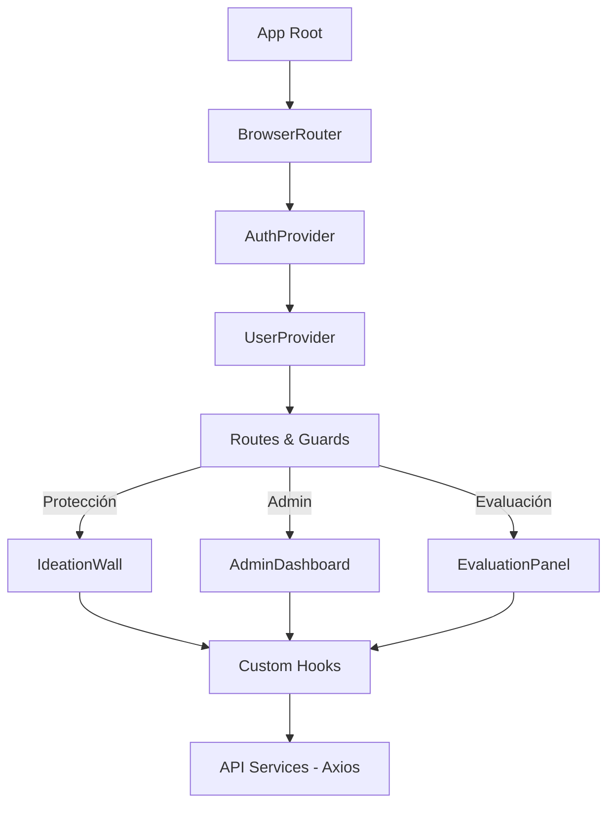

# Pista 8 - Frontend (Experiencia de Usuario)

Este repositorio contiene la interfaz de usuario interactiva de Pista 8. Construida con React y TypeScript, la aplicación ofrece una experiencia fluida, responsiva y visualmente premium, centrada en la gamificación y la ideación colaborativa.

## Arquitectura Frontend

La aplicación utiliza una arquitectura basada en Componentes de Función y Hooks Personalizados, organizada por dominios de funcionalidad.



### Gestión de Estado y Contexto
- AuthContext: Gestiona la sesión de Firebase y los tokens de acceso.
- UserContext: Cachea el perfil del usuario de MongoDB, incluyendo puntos, facultad y rol.
- Custom Hooks: Encapsulan la lógica de formularios (useIdeationForm) y estados complejos del dashboard (useDashboardState).

## Estructura del Proyecto

```text
frontend/
├── src/
│   ├── components/
│   │   ├── admin/        # Panel de control y constructor de retos.
│   │   ├── auth/         # Login, Registro y Autenticación con Google.
│   │   ├── challenges/   # Tarjetas, validaciones y filtros de retos.
│   │   ├── common/       # Componentes reutilizables (Botones, Guards, Toasts).
│   │   ├── dashboard/    # Muro de ideas, lista de retos y estadísticas.
│   │   ├── errors/       # Intercepción de errores y vistas 404.
│   │   ├── evaluations/  # Criterios de evaluación y vistas de juez.
│   │   ├── profile/      # Gestión de perfil, bio y actividad.
│   │   └── form/         # Utilidades y primitivas de formulario.
│   ├── config/           # Configuración de Firebase y Pista8Theme.
│   ├── context/          # Estado global (Auth y User).
│   ├── services/         # Clientes API (auth, challenge, idea, user).
│   ├── hooks/            # Lógica compartida (Navegación, Toasts).
│   └── styles/           # Estilos globales y animaciones de keyframes.
```

## Stack Tecnológico
- Core: React 18 + TypeScript
- Construcción: Vite
- Estilos: Styled-Components (CSS-in-JS)
- Navegación: React Router DOM v6
- Autenticación: Firebase SDK

## Guía de Diseño (UI/UX)
Pista 8 sigue un lenguaje visual centrado en:
- Gradients & Shadows: Uso de sombras sutiles y gradientes profundos para jerarquía.
- Micro-interacciones: Animaciones fadeUp y estados hover reactivos.
- Tipografía: Tipografía moderna (Inter) para máxima legibilidad.

## Configuración y Desarrollo

1. Instalación: `pnpm install`
2. Entorno: Crear `.env` con las credenciales de Firebase API.
3. Desarrollo: `pnpm run dev`
4. Build para Producción: `pnpm run build`

---

## Equipo 15 - Desarrollo
- Franco Leonel Avaro Oliva 
- Guilherme da Silva Santana de Almeida 
- Roberto Rodriguez Giorgetti

*Proyecto de Sistemas II - UNIVALLE 2026*
